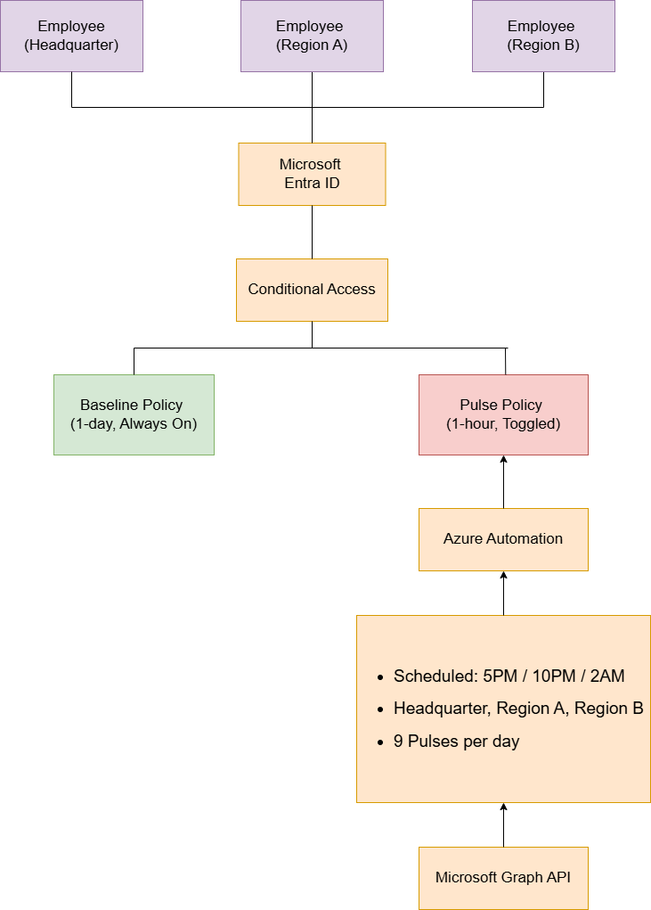
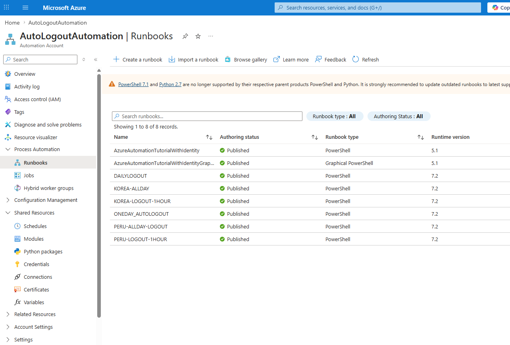
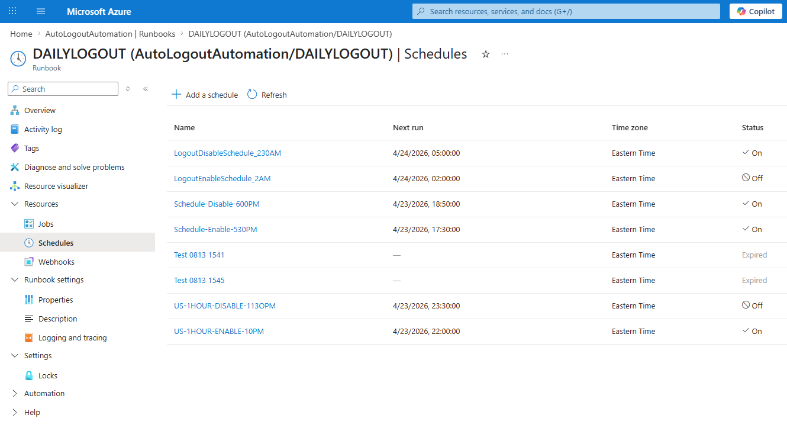

# Global Timezone-Aware Auto Logout Automation

> Enforced daily credential re-authentication across a multi-region Microsoft 365 tenant using a **pulsed Conditional Access Policy toggle** architecture, orchestrated by Azure Automation Runbooks against Microsoft Graph. Designed to neutralize credential-theft and off-hours attack vectors **without breaking the Odoo ERP ↔ Outlook SMTP token chain** that a naive `revokeSignInSessions` approach would destroy.

**Duration:** July 2025 – August 2025
**Role:** Cybersecurity Specialist (Sole Architect & Implementer)

---

## 📌 Overview

### Background

Two concurrent risks drove this project:

1. **Real credential-theft / phishing attempts were observed** against corporate Microsoft 365 accounts, raising concern about long-lived sessions being silently reused by attackers.
2. **Gaps in MFA coverage** were discovered on a subset of legacy accounts — sessions established before enforcement could remain valid indefinitely.

The security team needed a system that would:

- **Force every employee to re-authenticate (and therefore re-verify MFA)** on a predictable cadence.
- **Specifically neutralize off-hours attacks** — when an attacker in a different timezone could otherwise operate against a dormant session during the victim's night hours.
- **Not destabilize downstream integrations**, especially the internal Odoo ERP, whose Outlook SMTP integration depends on a continuous Microsoft token chain.

### Goal

Build a scheduled, multi-region, **non-destructive** session-reset automation that triggers three enforcement pulses per day, localized to each regional office's working hours.

---

## 🏗️ Architecture



### Enforcement Model

Two Conditional Access Policies work in tandem:

| Policy | Sign-in Frequency | State | Role |
|---|---|---|---|
| **Baseline CA Policy** (`Logout No Odoo Impact`) | **1 day** | Always **On** | Guarantees a minimum of one MFA-backed re-authentication per day for every user |
| **Pulse CA Policy** (`1HOUR Logout No Odoo Impact`) | **1 hour** | **Toggled On/Off** at scheduled times | When enabled, any session older than 1 hour is forced to re-authenticate — producing a surgical "logout pulse" |

Regional variants of the Pulse policy exist per office (`KOREA 1HOUR Logout No Odoo Impact`, `PERU 1HOUR LOGOUT`, etc.), each toggled on the local timezone.

### Daily Pulse Schedule (per region, local time)

| Time | Security Purpose |
|---|---|
| **5:00 PM** | End-of-business cleanup — invalidate sessions left behind on office workstations |
| **10:00 PM** | Remote-work cutoff — terminate credentials still active on employees' home devices |
| **2:00 AM** | **Off-hours attack mitigation** — disrupt any foreign-timezone attacker operating silently against a dormant session |

Each pulse is a pair of Runbook executions: one to **Enable** the 1-hour policy at the trigger time, and another to **Disable** it ~30 minutes later, returning the tenant to baseline.

---

## 🛠️ Tech Stack

### Automation & Identity
- **Azure Automation Account** (`AutoLogoutAutomation`) — Runbook host
- **PowerShell 7.2 Runbooks** — Policy toggle logic
- **System-Assigned Managed Identity** — Auth to Microsoft Graph (no stored secrets)
- **Microsoft Graph API** (`v1.0`) — `PATCH /identity/conditionalAccess/policies/{id}`

### Identity & Access
- **Microsoft Entra ID** — Tenant identity provider
- **Conditional Access** — Policy enforcement layer
- **Microsoft Authenticator** — Mandatory MFA method, pushed to every employee

### Graph API Permissions (granted to the Managed Identity)
- `Policy.Read.All`
- `Policy.ReadWrite.ConditionalAccess`

---

## ⚙️ Implementation Details

### Step 1 — Baseline Hardening
- Conditional Access Policy requiring **MFA on every sign-in** enabled tenant-wide.
- **Microsoft Authenticator enrollment enforced** for all employees during a company-wide cybersecurity training session.
- Baseline `Logout No Odoo Impact` policy (1-day Sign-in Frequency) turned on and left permanently enabled.

### Step 2 — Pulse Policies (per region)
- Dedicated 1-hour Sign-in Frequency policies created for each regional office (US, Korea, Peru).
- All Pulse policies scoped to only the employees in their respective region, so a toggle in Korea does not affect US users and vice versa.

### Step 3 — PowerShell Runbook (`AutoLogoutToggle`)

The Runbook accepts an `-Action Enable|Disable` parameter and a list of target Policy IDs, then `PATCH`es `state` on each via Graph. Key design choices:

- **Managed Identity auth** by default — zero stored secrets.
- **App Secret fallback** supported for local testing.
- **Token claim inspection** — decodes the JWT on acquisition and verifies `roles` contain `Policy.ReadWrite.ConditionalAccess` before attempting writes.
- **Optimistic PATCH path** — if the Managed Identity holds only `Policy.ReadWrite.ConditionalAccess` (no `Policy.Read.All`), the Runbook skips the pre-GET and PATCHes directly.
- **DryRun mode** — `-DryRun` simulates without mutating state. Used for every schedule change before production rollout.
- **Transient retry** — exponential backoff on 403/429/5xx with `MaxRetry = 5`.
- **NeverDisable guard list** — protects critical policies from accidental disable even if their ID is passed in.
- **GUID format validation** on every input Policy ID.

The full sanitized script is in [`scripts/AutoLogoutToggle.ps1`](./scripts/AutoLogoutToggle.ps1).

### Step 4 — Schedule Wiring
Each Runbook was bound to paired Schedules in the Automation Account:



Separate Runbooks (`DAILYLOGOUT`, `KOREA-ALLDAY`, `KOREA-LOGOUT-1HOUR`, `PERU-ALLDAY-LOGOUT`, `PERU-LOGOUT-1HOUR`, `ONEDAY_AUTOLOGOUT`, etc.) were created so each region's pulse cadence could be managed independently without cross-region blast radius.



Each region has Enable/Disable schedule pairs bracketing every pulse window (e.g. `Schedule-Enable-530PM` + `Schedule-Disable-600PM`), and equivalents at 10 PM and 2 AM — tripled across regions for a total of nine enforcement pulses per 24-hour cycle tenant-wide.

### Step 5 — Employee Rollout
- **Company-wide cybersecurity training session** conducted in person.
- Employees walked through Microsoft Authenticator installation, registration, and MFA sign-in flow.
- Conditional Access enforcement was turned on only after verified Authenticator enrollment for every account.

---

## 📐 Design Decision — Why Policy Toggle Instead of `revokeSignInSessions`

The most obvious implementation would have been to schedule a daily call to Microsoft Graph's `POST /users/{id}/revokeSignInSessions` endpoint, which immediately invalidates all refresh tokens for a user. This approach was **explicitly evaluated and rejected**.

### The problem: dependency cascade into Odoo + Outlook SMTP

The internal **Odoo ERP** authenticates users via Microsoft (Entra ID) sign-in. Outbound mail from Odoo flows through **Outlook SMTP**, and the SMTP connector relies on a Microsoft token bound to the same session.

A blanket `revokeSignInSessions` would therefore trigger this chain:

```
revokeSignInSessions
        ↓
Microsoft refresh tokens revoked
        ↓
Odoo session broken (Microsoft-backed auth lost)
        ↓
Odoo ↔ Outlook SMTP token invalidated
        ↓
Outbound mail pipeline broken
        ↓
Admin must manually reconnect the SMTP integration
        ↓
…repeat three times per day, per region, per user
```

Across a multi-region deployment with three daily pulses, this would have meant **hundreds of manual SMTP reconnections per week**, converting the security automation into a larger operational problem than the one it was meant to solve.

### The chosen alternative

Pulse the **state** of the 1-hour Sign-in Frequency Conditional Access Policy instead of revoking tokens directly. This approach:

- Achieves the **same security outcome** — every user is forced through a fresh sign-in + MFA challenge on schedule.
- Is **non-destructive to the refresh token chain** — Odoo's Microsoft-backed session and the Outlook SMTP token are renewed, not invalidated.
- Can be **scoped per region** by targeting only that region's CA policy.
- Is **reversible** — a bad rollout is undone by a single `Disable` Runbook execution, not by manual session recovery.
- Leaves a **clear audit trail** in Entra ID sign-in logs and Conditional Access change logs.

This is the kind of decision that does not appear in the requirements document; it only surfaces when the implementation meets the production environment.

---

## 📈 Outcome

- **Nine scheduled re-authentication pulses per day** across three regions, every user covered.
- **Zero manual SMTP reconnections** required — Odoo ↔ Outlook integration remained stable throughout rollout and steady-state operation.
- **Off-hours attack window narrowed** — a dormant session cannot survive an attacker's operating day in another timezone longer than the gap to the next local pulse.
- **100% MFA coverage** achieved across the tenant after the training rollout.
- **No stored credentials in the automation layer** — all Runbook-to-Graph auth flows through Managed Identity.

---

## 🔐 Security Considerations

| Concern | Mitigation |
|---|---|
| Accidental disable of a protective policy | `NeverDisable` guard list embedded in the Runbook; GUID-level protection |
| Credential exposure in automation | **Managed Identity only** — no client secrets in source or Automation variables |
| Privilege creep on the automation identity | Graph permissions scoped to exactly two: `Policy.Read.All` + `Policy.ReadWrite.ConditionalAccess` |
| Unverified writes on permission confusion | Token `roles` decoded and checked **before** any PATCH attempt |
| Bad parameter injection | Every Policy ID regex-validated as a proper GUID before use |
| Rollout mistakes | `-DryRun` mode required for every schedule change before production |
| Transient Graph failures | Exponential-backoff retry (403 / 429 / 5xx) with a 5-attempt ceiling |
| Cross-region blast radius | Each region has its own Pulse policy and its own Runbook — a Korea toggle cannot affect US users |

---

## 🚀 Future Improvements

- **Webhook-based ad-hoc revocation** for compromised accounts (single-user `revokeSignInSessions` path, gated behind an approval step).
- **Sentinel alert integration** — on suspicious sign-in detection, trigger an immediate off-schedule Pulse on that user's region.
- **Dynamic Policy ID resolution** by display name to reduce hardcoded GUIDs.
- **Schedule-as-code** — move Automation Account schedules to Bicep/ARM for version control.

---

## 📁 Repository Structure

```
.
├── README.md
├── diagrams/
│   ├── architecture.png
│   └── architecture.drawio
├── screenshots/
│   ├── runbooks.png
│   ├── schedules.png
│   └── ca-policies.png
└── scripts/
    └── AutoLogoutToggle.ps1
```

---

## ⚠️ Disclaimer

This documentation describes the architecture, workflow, and design decisions only. All Policy IDs, Tenant IDs, Subscription IDs, user identities, and company-identifying information have been redacted or replaced with placeholders. The published PowerShell script is a sanitized copy; no credentials, webhook URLs, or internal identifiers are included.

---

## 👤 Author

**Changjae Chung** — Cybersecurity Specialist
🔗 [LinkedIn](https://www.linkedin.com/in/changjae-chung-374821176)
